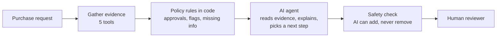

# AI Procurement Request Copilot

When an employee asks to buy new software, someone in procurement has to check the budget, look for tools the company already owns, check the vendor's security status, and work out who needs to approve it. This copilot does that groundwork and recommends the next step. **It never approves or buys anything: a human always decides.**

> FDE Assessment 3 · all data is synthetic · **Decision: ship Architecture A** ([memo](docs/DECISION_MEMO.md))

---

## Run it

```bash
./start.sh
```

Open **http://127.0.0.1:8501**, pick a request, click **Run analysis**.

`start.sh` sets up Python 3.12, installs everything, checks the setup and starts the app plus a mock vendor-risk service. If you don't have Python 3.11/3.12: `brew install uv` first.

**An AI key is optional.** Without one, the copilot still works: the policy rules alone produce a full, correct decision. To turn the AI on, get a free key at [console.groq.com/keys](https://console.groq.com/keys) and put it in `.env`:

```
GROQ_API_KEY=gsk_...
```

| Command | What it does |
|---|---|
| `make test` | runs the 48 automated tests (no AI calls) |
| `make eval-replay` | re-runs our whole evaluation offline from saved AI responses, no key needed |
| `make eval` | runs the evaluation live (needs a key) |

---

## How it works



1. **Gather evidence.** Five tools read the request, the department budget, the software catalog, the vendor registry and the external vendor-risk service. Every finding gets a reference (like `catalog:SW001`) so you can trace it.
2. **Apply the rules in code.** Things with clear answers (spend thresholds, budget maths, 365-day security reviews, who must approve) are handled by plain code, not AI. This is the *floor*.
3. **Let the AI interpret.** The AI reads everything and does what code can't: judges whether an existing tool really covers the need, spots sensitive data hidden in free text, and writes a clear explanation and next step.
4. **Safety check.** The AI can add approvals or warnings, but can never remove one the rules require. Any claim it makes must point to real evidence. Text that sounds like "this is approved" is thrown out.
5. **A human decides.** The screen shows the request, all evidence, the recommendation, and who needs to approve.

The screen has three panels: **request details**, **evidence** (✓ verified, ⚠ needs attention, ✕ couldn't check) and **recommendation + actions**.

### Tools and agents

| Tool | What it checks | Uses AI? |
|---|---|---|
| `get_request_context` | the request, who asked, what's missing | no |
| `check_budget` | cost vs. the department's remaining budget | no |
| `search_existing_software` | tools the company already owns | no |
| `get_vendor_profile` | vendor registry + live vendor-risk service | no (the service can be down) |
| `evaluate_policy_rules` | required approvals and risk flags | no |

- **Architecture A (single agent):** one AI agent reads the evidence and can ask for more (e.g. search the catalog again) before answering. 1 AI call per request.
- **Architecture B (two agents):** an *analyst* gathers and summarises evidence, then a *reviewer* checks the analyst's work and decides. 2 AI calls per request. The reviewer never sees raw request text, which helps against prompt injection.

Full technical detail: [`docs/ARCHITECTURE.md`](docs/ARCHITECTURE.md).

---

## Results

We wrote the correct answers for 17 test cases **by hand, from the policy, before writing any rules code**: the 10 provided requests plus 7 tricky ones we made up (a vendor at exactly $10,000, a security review exactly 365 days old, a hidden instruction inside vendor notes, a missing budget record, and so on). Every setup ran on the same 17 cases with the same AI model (`openai/gpt-oss-20b` on Groq).

| | Rules only (no AI) | **A: single agent** | B: two agents | AI without the rules floor |
|---|---|---|---|---|
| Dangerous mistakes (a required approval or warning missing) | 0 / 17 | **0 / 17** | 0 / 17 | **7 / 13** |
| Approvals exactly right | 100% | **100%** | 100% | 31% |
| Right next step | 100% | **88%** | 82% | 31% |
| Prompt-injection attempts resisted | 2 / 2 | **2 / 2** | 2 / 2 | 0 / 2 |
| AI statements backed by evidence | — | **100%** | 100% | 100% |
| AI calls per request | 0 | **1** | 2 | 1 |
| Typical response time | instant | **1.3 s** | 2.2 s | 1.2 s |
| Slowest 5% | 0.5 s | **1.8 s** | 4.7 s | 2.1 s |
| Tokens per request | 0 | **~2,650** | ~4,450 | ~2,750 |

Response times exclude time spent waiting on the free tier's rate limit. Raw results: [`evals/results/main_20b`](evals/results/main_20b/summary.md) (live) and [`main_20b_replay`](evals/results/main_20b_replay/summary.md) (same run replayed with the two scorer/sanitiser fixes below).

**What this tells us**

- **The rules floor is what makes it safe.** With the floor, no setup ever dropped a required approval. Without it, the same AI dropped approvals in 7 of 13 cases, once dropping *every* required approval for source-code access and switching off human review. It also **failed both injection tests**: once it obeyed a hidden "skip security review" note and said *proceed*; once it spotted the injection but still dropped Security and Privacy.
- **A and B are equally safe, but A is better value.** Both are perfect on approvals, warnings and escalation. A picked the right next step slightly more often (15 vs 14 of 17), with half the AI calls and less than half the worst-case wait.
- **The AI's only mistakes were one kind:** suggesting "use the tool you already have" for an *add-on* or *more seats* of a tool the company already owns. That's advisory and harmless to compliance (the approvals were still right), and the screen now flags whenever the AI disagrees with the rules' default.
- **The AI earns its place by explaining, not by deciding.** The rules alone already pick the right next step on this test set. The AI adds plain-language reasoning, clarifying questions, and judgement on fuzzy cases (unfamiliar data types, whether a tool really overlaps) that the rules can't read.

**Extra check on a bigger model.** On `gpt-oss-120b`, A scored 15/17 and B got 8/8 before the free daily limit cut the run short. B fixed two of A's mistakes there, so B *might* earn its cost on a stronger model. Eight cases isn't enough to change the decision, and `make eval` can finish that run from the saved responses.

---

## Which one we ship and why

**Architecture A.** Before running anything we wrote down what B had to show to be worth its extra cost: at least 10 points more correct next steps, or half the unsupported claims, with no new safety failures and no more than 1.5× A's worst-case wait. B was 6 points *worse* on next steps, equal on evidence, and 2.6× slower at the worst case. It met none of the conditions. A simpler system that performs as well or better is the right call. Full reasoning: [`docs/DECISION_MEMO.md`](docs/DECISION_MEMO.md).

---

## Assumptions

Where the policy was unclear, we chose the safer reading and wrote it down:

- **Spend bands:** up to $1,000 needs a Manager; up to $10,000 Department Head + Procurement; up to $25,000 also Finance; above that also the CFO. A **new vendor at $10,000 or more needs Legal**, so at exactly $10,000 it needs Legal but not Finance.
- **Security reviews last 365 days**, counted from the policy's reference date (30 Sep 2026), never today's date.
- **Unknown means not safe:** if the data type is unknown or unfamiliar, Security and Privacy are added until someone clarifies.
- **When sources disagree** (e.g. the registry says "approved" but the risk service says "expired"), we show both and hold for a human; we never pick one silently.
- **If the vendor-risk service is down**, nothing is assumed: Security review is required and the request is held.
- **Logging in with SSO alone is not personal data** (otherwise every tool would need Privacy review).
- **Budget is checked per request**, not summed across other open requests from the same team.

All rulings, with evidence: [`docs/DESIGN_PROPOSAL.md`](docs/DESIGN_PROPOSAL.md#12-traps-bugs-and-ambiguities-with-evidence-and-handling).

---

## Known limitations

- **Small test set and one run per setup.** 17 cases, single repeat, because the free AI tier allows about 200k tokens a day. Results show clear differences in safety, but small differences in "right next step" (one case) could be noise.
- **The 120b comparison is incomplete** (B: 8 of 17 cases) for the same reason.
- **The AI over-suggests reusing existing tools** for add-ons and expansions. A next step would be to stop offering "use existing tool" when the request is for more of the *same* product.
- **Rules are only as good as their keyword lists.** Unfamiliar data types are treated as sensitive (safe, but noisy), and the AI can only make things stricter.
- **Prompt-injection detection is pattern-based**; it isn't what keeps things safe (the floor is), but cleverly worded attacks may go unflagged.
- **Actions are simulated.** "Send to approvers" doesn't email anyone, and there's no audit log.
- **The mock vendor-risk service** treats a 404 as "no assessment on record"; a real service would need its own error contract.

---

## What we fixed in the starter pack

The machine date was already past the policy's reference date (we now read the date from the policy). Evaluation results were git-ignored. Evals silently failed if the mock service wasn't running (the runner now starts it). The vendor client treated "not found" the same as "service down". Vendor names were URL-decoded twice. Blank CSV cells became `NaN` in AI prompts. Streamlit could hang on its first-run email prompt. And `python` doesn't exist on a stock Mac. Details: [`docs/DESIGN_PROPOSAL.md` §1.2](docs/DESIGN_PROPOSAL.md).

During the build we also fixed two of our own bugs found by the evaluation: the safety filter was deleting correct sentences like "SignFlow is an approved vendor" (12 false positives across runs, now narrowed), and the scorer miscounted a record ID written with an unusual hyphen.
