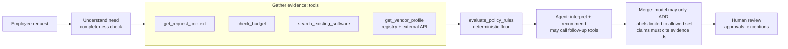
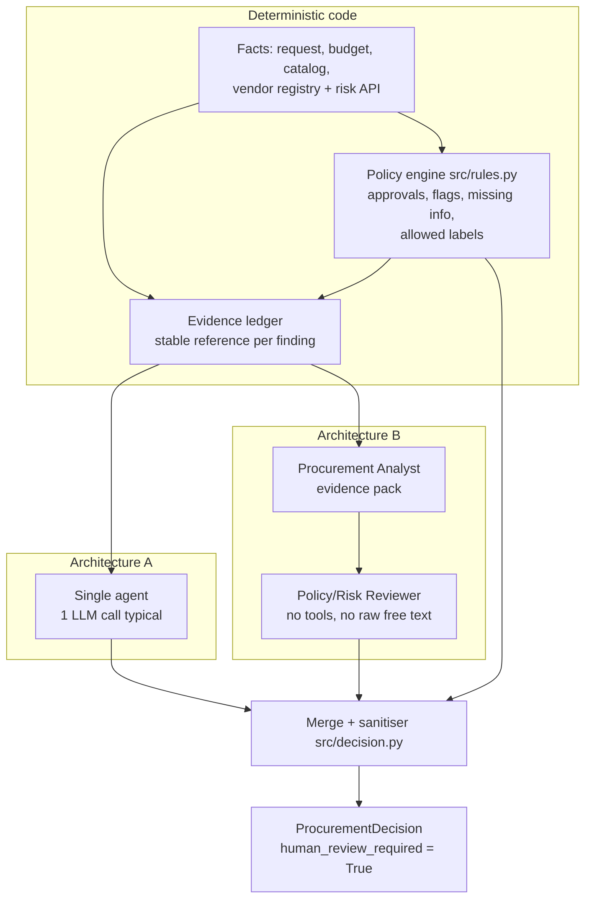

# Architecture and design details

Technical companion to the [README](../README.md). The original design rationale (before building) is in [`DESIGN_PROPOSAL.md`](DESIGN_PROPOSAL.md).

## Product workflow



The UI (Streamlit) shows the three required panels:

1. **Request details** — fields, with the requester's free text shown as untrusted data (highlighted when it contains instructions).
2. **Evidence panel** — every finding grouped by tool, with its record reference (`catalog:SW001`, `vendor_api:BrandBoard`, `policy:s4` …) and a status icon (✓ verified, ⚠ stale/conflict/missing, ✕ unavailable).
3. **Recommendation + action** — label, rationale, required approvals (each with the rule that triggered it), risk flags, missing information, next step, and reviewer actions (send to approvers / request clarification / escalate). Actions are simulated: nothing is purchased or approved.

Output contract (`src/contracts.py`, unchanged except optional telemetry fields): `recommendation | evidence | required_approvals | missing_information | risk_flags | next_step | human_review_required | telemetry`. The recommendation string starts with one of five labels: `proceed_to_standard_approval`, `route_for_specialist_review`, `use_existing_tool`, `request_clarification`, `hold_for_manual_review`.


## Architecture

**AI interprets and recommends; code owns thresholds and deterministic checks; humans own approvals and exceptions.**



### Tools

All tools are bound to the request under review (the model cannot point them at another request) and none of them writes, approves or buys.

| Tool | Deterministic | Source | Used by |
|---|---|---|---|
| `get_request_context` | yes | requests.json, employees.csv | code (mandatory) |
| `check_budget` | yes | department_budgets.csv | code (mandatory) |
| `search_existing_software(query?)` | yes | software_catalog.csv, purchase_history.csv | code + agent follow-up |
| `get_vendor_profile(vendor_name?)` | logic yes; availability no | vendors.csv + **external vendor-risk API** | code + agent follow-up |
| `evaluate_policy_rules` | yes | policy engine | code (mandatory) |

The five mandatory tools run through the same registry (and telemetry) before the first LLM call; the agent keeps native function calling for follow-up evidence. **Why:** in a pilot, letting `gpt-oss-120b` call the five tools itself cost 6 LLM calls and ~10k tokens per request (one tool per turn) and it skipped `get_vendor_profile`. The redesign uses ~1 call and ~3k tokens, which also fits the free tier's 200k tokens/day.

### Deterministic vs LLM

| Concern | Owner |
|---|---|
| Required fields present (null / "unknown" / blank; `[]` integrations = none) | code |
| Budget arithmetic, missing budget record | code |
| Overlap candidates (same vendor / category / product) and the `existing_tool_overlap` flag | code |
| Does an existing tool *really* cover the need? Is the stated gap credible? | **LLM** (chooses `use_existing_tool` if allowed) |
| Financial approval band, Legal $10k threshold | code |
| Security / Privacy / Legal triggers from data level, integrations, vendor status, region | code |
| Data sensitivity hidden in free text or unknown vocabulary | **LLM, upward only** |
| Vague business purpose | **LLM, can add a missing field** |
| Review age vs 365 days (policy reference date, never the machine clock), registry vs API conflicts | code |
| Prompt-injection detection | code scanner + LLM (either can add the flag) |
| Recommendation label | code computes the allowed set, **LLM picks** within it |
| Rationale, next-step guidance, clarification questions | **LLM**, sanitised and grounded |
| `human_review_required` | code, always `True` |

### How the floor is enforced (`src/decision.py`)

- approvals and flags = code floor ∪ model additions (restricted to known roles/flags); runtime assertions fail if any code-derived item is missing;
- the label must be in the code-computed allowed set, else the default is used;
- model interpretations must cite evidence ids present in this run's ledger, else they are dropped;
- model text that claims an approval was granted, or reads like an injection, is discarded;
- any LLM failure (quota, invalid JSON after one repair, network) falls back to the deterministic decision with `telemetry.fallback_reason` set.

### Agents

- **A — single agent** (`src/agents/single.py`): sees the mandatory tool results, may call follow-up tools (max 2 turns), returns a JSON assessment. Typical: 1 LLM call.
- **B — analyst → reviewer** (`src/agents/staged.py`): the analyst gets the same evidence and tools and returns an *evidence pack* (findings with evidence ids, overlap view, neutral paraphrase of the stated gap, concerns, upward additions). The reviewer has no tools, never sees raw request free text or quoted injected text, audits the pack against the ledger and chooses the label. Code unions both agents' additions. Typical: 2 LLM calls.
- Both share the same tools, floor, merge, sanitiser and fallback. Plain OpenAI SDK, hand-rolled loop (no framework), so every call is counted.

### Reliability and human controls

| Situation | Behaviour |
|---|---|
| Missing request info | only `request_clarification` allowed; specific fields listed |
| Unknown / unrecognised data level | Security + Privacy required until clarified (never assumed safe) |
| Registry and risk service disagree | `conflicting_vendor_evidence`, both values shown, `hold_for_manual_review` |
| Review older than 365 days | `vendor_review_expired` + Security |
| Vendor-risk API down (503/timeout/refused) | one retry, then `vendor_risk_unavailable`, Security, nothing assumed, hold |
| Vendor-risk API has no record (404) | assessment missing: Security, not an outage |
| Department has no budget record | `budget_unverifiable` + Finance, hold |
| Injection in request, vendor notes or API notes | flagged, ignored, floor unaffected, model text sanitised |
| LLM quota / error / invalid output | deterministic decision, reason recorded |


## Assumptions

Policy ambiguities and how they were resolved (full list with evidence: [`DESIGN_PROPOSAL.md` §1.2](DESIGN_PROPOSAL.md)):

- **Bands:** ≤$1,000 Manager; ≤$10,000 Dept Head + Procurement; ≤$25,000 + Finance; above + CFO. Legal for a new vendor is **≥ $10,000**, so a new vendor at exactly $10,000 needs Legal but not Finance.
- **Review validity:** current while `(reference date − review date) ≤ 365 days`. Reference date is parsed from the policy (2026-09-30).
- **New vendor:** registry `procurement_status` not `Approved`, or absent from the registry. Legal terms are standard if `Approved` or `Standard`.
- **Conflict:** canonical statuses differ (`Pending` ≡ `not_completed`, so BrandBoard is *not* a conflict) or both sources have different review dates.
- **Sensitive data:** employee/customer PII, confidential documents, credentials (+ source code, production access for Security). Sensitive data with a vendor storing data outside the region → Privacy + Legal. SSO alone is not employee PII.
- **Unknown cost:** no tier is guessed; Procurement triages.
- **Budget** is checked per request (open requests from the same department are not summed — listed as a limitation).
- `human_review_required` is always `True`; the escalation level is expressed through approvals and the label.


## Repository layout

```
src/
  config.py          reference date (from policy), data dir override
  data_access.py     JSON-safe data readers
  vendor_client.py   typed vendor-risk client (ok / not_found / unavailable, retry)
  facts.py           evidence gathering + ledger entries
  rules.py           deterministic policy engine (the floor)
  tools.py           agent-visible tool registry
  safety.py          injection scanner + output sanitiser
  decision.py        merge: floor + model assessment -> ProcurementDecision
  agents/            single.py (A), staged.py (B), ablation.py (eval only), common.py, prompts.py
  llm/               OpenAI-compatible client (limiter, cache), provider settings
  solution.py        handle_request(request_id, architecture) adapter
app.py               Streamlit UI
evals/               gold_cases.json, fixtures/, run_eval.py, scoring.py, results/, llm_cache/
tests/               unit + integration tests
docs/                design proposal, decision memo
```
